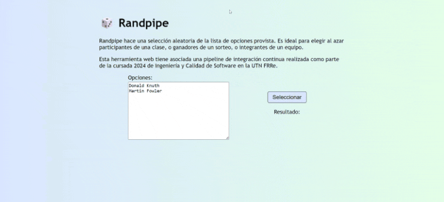
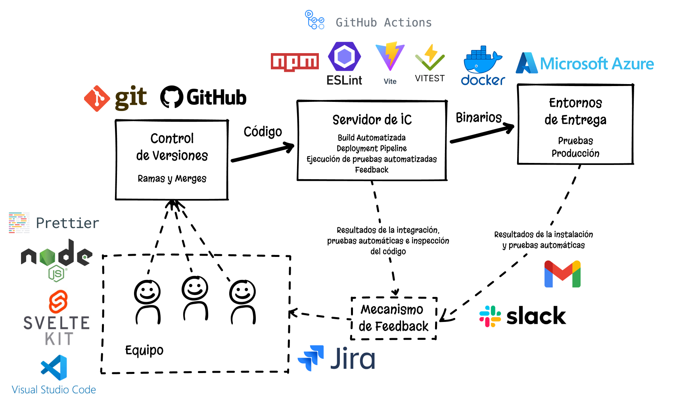
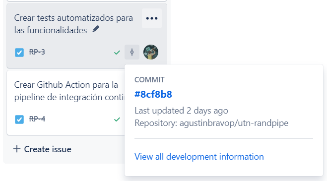

# 🎲 Randpipe

Simple app web que es parte de una pipeline de integración continua (y despliegue continuo), desarrollada como parte del cursado de Ingeniería y Calidad de Software.

## Funcionalidades

La aplicación es una simple página web (HTML + CSS + JS) construida con `SvelteKit` (framework de JavaScript) con una única funcionalidad que permite seleccionar al azar de un listado de opciones.

## Pipeline de CI/CD

Este proyecto se centra en la pipeline de CI/CD que da soporte al desarrollo de la app.

La implementación de la integración continua se puede encontrar en el archivo `/.github/workflows`. Se utiliza **GitHub** como repositorio remoto para el control de versiones, **GitHub Actions** como servidor de integración continua y la nube de **Microsoft Azure Web Service** como entorno de entrega.

La pipeline se dispara al hacer un commit o pull request a la rama `main` y tiene los siguientes pasos:

1. **Checkout:** se accede al código de la rama para ser utilizado en los siguientes pasos.
2. **Preparar node:** instala `node` (entorno de ejecución de JavaScript) y `npm` (gestor de paquetes de NodeJS) para poder ejecutar el código.
3. **Instalar dependencias:** ejecuta `npm install` para descargar todas las dependencias del proyecto estipuladas en el `package.json`.
4. **Inspección de código:** `ESLint` inspecciona el código para verificar que se cumplan sus reglas, mejorando la calidad. También se verifica que se cumpla la guía de estilos de código configurada con `Prettier`.
5. **Pruebas automáticas:** `Vitest` es el _test runner_ que ejecuta las pruebas unitarias y de componente. Se utiliza `jsdom` como enorno (minimalista) de navegador.
6. **Construcción:** `Vite` construye la aplicación, compilando de `Svelte` a JavaScript, minimizando el JavaScript generado y dividiéndolo en chunks. Se hace solo para verificar que el proyecto compila correctamente, ya que no es necesaria una build para los pasos previos, y se la vuelve a construir dentro de la imagen de Docker.
7. **Containerización:** se construye una imagen de `Docker` (definida en el archivo `Dockerfile`) que empaqueta la aplicación para luego ser deployada en cualquier entorno que pueda correr containers. Esa imagen es almacenada en el container registry de _GitHub Packages_.
8. **Despliegue:** se envía a _Microsoft Azure Web App_ el nombre de la nueva imagen a deployar. Azure se encarga de descargar esa imagen de GitHub Packages y luego migra el deployment a la nueva versión.
9. **Feedback:** se integra la pipeline con una _Slack App_ para recibir un mensaje automático que indique el resultado final de la run. Tener un canal de Slack dedicado a estos mensajes es mucho más cómodo que recibir un email por cada ejecución del workflow.

Algunos instantes luego de haber finalizado la ejecución de la pipeline, se debería poder ver la nueva versión desplegada en https://randpipe.azurewebsites.net/. Nota: el link estará desactualizado una vez terminado y presentado el proyecto, o cuando el deployment sea eliminado de Microsoft Azure.

### Trazabilidad

Se utilizó **Jira** para la planificación del trabajo y gestión de tareas. Este repositorio de GitHub está configurado para que los commits que en su descripción incluyan un código `RP-<num>` tengan embebido en ese código un hipervínculo hacia su tarea asociada en Jira con ese número identificador.

También se puede ver desde Jira los commits asociados a las tareas gracias a una app "GitHub for Jira", de manera que la trazabilidad es bidireccional. Al aceptar el merge de una pull request en GitHub, está configurada una regla de Jira Automation para automáticamente mover a "DONE" el issue asociado.

Como principal mecanismo de notificaciones, se tiene un workspace de **Slack** configurado para recibir (en un canal específico) un mensaje cada vez que una ejecución de la pipeline termina. Ese mensaje indica el estado final de la ejecución y provee links al repositorio.
